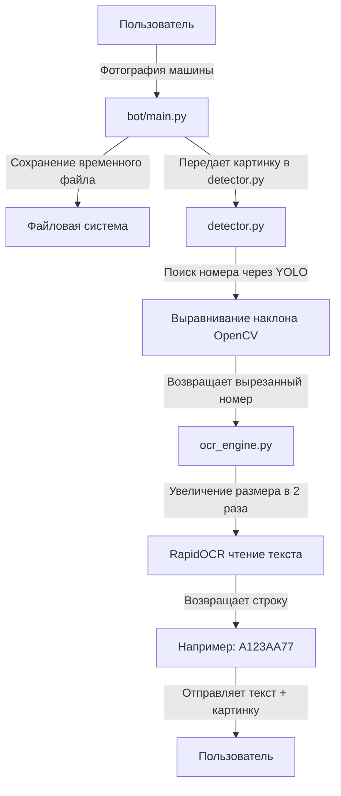

# MVP version


## Схема работы бота для распознавания номеров



## Детектор (detector.py)

Задача — найти и вырезать номер, даже если машина сфотографирована под углом.

- *Поиск:* Скрипт загружает нейросеть YOLO (модель license_plate_detector.pt). Она обучена видеть на картинках автомобильные номера и выдает их координаты `(x1, y1, x2, y2)`.

- *Кадрирование:* К найденным координатам добавляется небольшой отступ в 5 пикселей `(pad = 5)`, чтобы не срезать края номера, и картинка обрезается.

- *Выравнивание (deskew_plate):* Если машина стоит боком или номер наклонен, этот метод находит контур рамки номера, вычисляет угол наклона (minAreaRect) и с помощью геометрии OpenCV (warpPerspective) трансформирует картинку так, будто её сфотографировали строго прямо.

## Распознаватель текста (ocr_engine.py)

Он получает на вход чистый, вырезанный и выровненный прямоугольник номера. Его задача — превратить пиксели в текст.

- *Подготовка:* Картинка номера обычно маленькая. Чтобы нейросеть лучше видела буквы, код добавляет вокруг номера искусственные белые поля (copyMakeBorder), а затем увеличивает изображение в 2 раза (cv2.resize) сглаживающим методом.

- *Распознавание:* Модель RapidOCR сканирует картинку и возвращает найденные блоки текста.

- *Очистка:* Код собирает все буквы вместе, убирает случайные пробелы, точки или спецсимволы (isalnum), делает все буквы заглавными (upper()) и проверяет, что в номере больше двух символов (чтобы отсечь случайный мусор).


Бот (bot/main.py)

Это бот на асинхронной библиотеке aiogram. Он скачивает фото из Telegram во временный файл (temp_...jpg).

Передает картинку в PlateDetector. Если номер найден, бот сохраняет его во второй временный файл (debug_...jpg), чтобы отправить пользователю в качестве подтверждения.

Передает этот вырезанный номер в LicensePlateReader для получения текста. Отправляет финальный ответ пользователю и обязательно удаляет все временные файлы с диска, чтобы сервер не переполнился.

##### Основная проблема: легкие задачи выполняются асинхронно, сложные вычисления - синхронно.


### Работы системы для двух параллельных обработок

Пользователь А отправляет фотографию машины, а через 0.1 секунды точно такое же фото отправляет Пользователь Б.

#### Шаг 1. Прием и скачивание (Асинхронно)

Робот получает фото от Пользователя А. Выполняется ```photo = message.photo[-1]``` и ```await bot.get_file()```.

Пока файл Пользователя А скачивается через ```await bot.download_file()```, поток процессора свободен. В эту же миллисекунду прилетает фото от Пользователя Б. Бот успешно переключается на него и тоже начинает скачивать его файл через ```await```.

На этом этапе оба пользователя обрабатываются параллельно.

#### Шаг 2. Включение «Тяжелой» графики (Синхронно)

Файл Пользователя А скачался первым. Код переходит к строке: ```image = cv2.imread(photo_path)```

Здесь await отсутствует. Поток процессора блокируется на чтение файла с диска. Пользователь Б в этот момент ждет, его задача «заморожена».


#### Шаг 3. Детекция номера для Пользователя А

Код заходит в detector.py в метод ```find_plate(image)```. Выполняется ```self.model.predict(image)```. 

Нейросеть YOLO загружает ядра процессора или видеокарты на 100%, чтобы найти рамку номера. Затем внутри OpenCV ищет контур ```(cv2.findContours)``` и делает математическое выравнивание ```(cv2.warpPerspective)```. 

Что происходит с Пользователем Б? Его запрос стоит в очереди. Бот физически не может среагировать ни на его фото, ни на команду /start от любого третьего пользователя, потому что поток занят расчетами YOLO для Пользователя А.

#### Шаг 4. Распознавание текста для Пользователя А

Метод ```find_plate``` возвращает вырезанный номер. Бот сохраняет его на диск через синхронный ```cv2.imwrite``` (поток всё ещё занят). 

Код передает картинку в ocr_engine.py в метод ```read_plate(image)```. Там происходят математические трансформации: добавление полей ```(cv2.copyMakeBorder)``` и увеличение картинки в 2 раза ```(cv2.resize)```. Запускается RapidOCR. Вторая нейросеть начинает сканировать пиксели в поисках букв. Это занимает еще некоторое время процессора. Поток полностью заблокирован.


#### Шаг 5. Освобождение потока и переключение на Пользователя Б

Текст распознан. Код доходит до: ```await message.answer()```

В эту же микросекунду бот вспоминает про «замороженный» запрос Пользователя Б, который ждал на Шаге 2.Поток переключается на Пользователя Б, загружает его картинку через ```cv2.imread(photo_path)```, и Пользователь Б начинает проходить точно такой же долгий и монопольный круг детекции и распознавания
