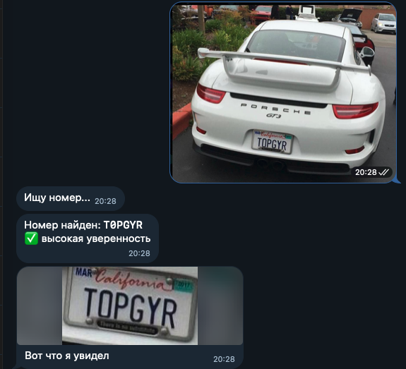
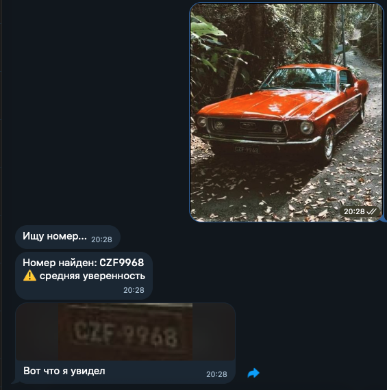
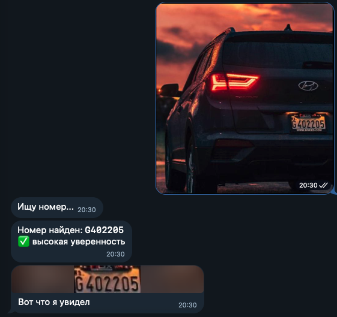

# Automatic License Plate Detector

Система автоматического распознавания автомобильных номеров (Европа/США), спроектированная для автономной работы на сервере — например, для обработки видеопотока с камеры без участия человека. Детекция номерной таблички реализована на YOLOv8, распознавание текста — на дообученной OCR-модели.

На данный момент отдельные компоненты системы (в первую очередь качество OCR и обработка видео) находятся в процессе доработки. Для тестирования пайплайна на реальных данных используется вспомогательный интерфейс — Telegram-бот, позволяющий быстро проверить работу системы на произвольных фото и видео.

## Как это работает

Пайплайн обработки одного кадра:

1. **Детекция таблички** — YOLOv8 находит номерную табличку на изображении, кроп вырезается с отступом и выравнивается по перспективе (deskew) по контуру таблички, чтобы скорректировать наклон и угол съёмки.
2. **Препроцессинг** — кроп апскейлится до целевого размера, контраст выравнивается через CLAHE, изображение дополнительно резкости через unsharp mask — это стабилизирует качество OCR на кропах низкого разрешения.
3. **OCR** — обработанный кроп распознаётся дообученной ONNX-моделью, которая возвращает текст номера и confidence по каждому символу. Итоговый confidence усредняется и переводится в метку `high / mid / low`.

Ниже — примеры работы фото-пайплайна на разных условиях съёмки (ракурс, освещение, контровый свет):

  
  
  

> На данный момент стабильно работает пайплайн для статичных изображений. Обработка видео (трекинг автомобиля между кадрами и агрегация нескольких прочтений номера) реализована, но пока не доведена до уровня надёжности, достаточного для демонстрации.

## Стек

**ML**
- **Ultralytics YOLOv8** — детекция номерной таблички на изображении
- **fast-plate-ocr (ONNX)** — распознавание текста номера; базовая модель дообучена на собственном датасете
- **OpenCV** — препроцессинг кропов и геометрические преобразования (deskew, CLAHE, sharpening)

**Dev / инфраструктура**
- **Python 3.11+**, **aiogram 3** — Telegram-интерфейс для тестирования пайплайна на реальных данных
- CI/CD (GitHub Actions), мониторинг и MLOps (версионирование данных/моделей, автоматизация переобучения) — в роадмапе, пока не реализовано

## Метрики

OCR-модель `cct-s-v2-global` дообучена на собственном датасете из 1813 размеченных номеров (Европа и США, примерно в равной пропорции). Метрика — полное совпадение строки номера (plate accuracy) на отложенной выборке:

| Модель | Plate accuracy |
|---|---|
| Предобученная (без дообучения) | 87.85% |
| Дообученная на собственных данных | **94.48%** |

> Датасет небольшой, поэтому эта цифра — ориентир на текущем этапе, а не финальная оценка качества системы.

## Текущие ограничения и roadmap

**Сейчас:**
- Пайплайн для статичных изображений работает стабильно.
- Обработка видео (трекинг автомобиля между кадрами по IoU, агрегация нескольких прочтений номера) реализована, но не доведена до уровня надёжности, достаточного для продакшена.
- OCR-модель дообучена на небольшом датасете (1813 записей) — возможны ошибки на нетипичных форматах номеров.

**В планах:**
- Расширение и балансировка датасета для OCR.
- Доведение видео-пайплайна до стабильной работы.
- Оптимизация инференса для минимального потребления ресурсов (расчёт на работу на слабом железе / edge-устройствах).
- Вынос системы из Telegram-бота в автономный сервис (обработка видеопотока с камеры без участия человека).
- CI/CD (GitHub Actions), мониторинг качества модели в продакшене, MLOps-практики (версионирование данных и моделей, автоматизация переобучения).

## Инженерные решения

**OCR-движок vs. специализированная модель.** Первая версия OCR строилась на RapidOCR (general-purpose движок, обёртка над PaddleOCR) — он проявил ряд системных проблем, не решаемых тюнингом параметров: терял первый/последний символ номера на узких кропах, галлюцинировал лишние символы от текстуры фона, давал нестабильный результат на соседних кадрах видео для одного и того же номера. Причина — движок не заточен под короткие строки фиксированного алфавита (номерной знак), а решает более общую задачу распознавания произвольного текста.

По итогу RapidOCR был заменён на fast-plate-ocr — модель, изначально спроектированную под распознавание номеров, дообученную дополнительно на собственном датасете. Это убрало галлюцинации и заметно снизило потерю крайних символов.
